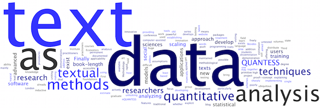

# R for Text Analysis

This workshop is a follow up to our [Introduction to R Workshop](https://github.com/BrockDSL/Intro_to_R_Workshop).  The goal of this workshop is to introduce the basics of using the R programming language for text prossessing and analysis.  By the end of this workshop you should learn the following:

- Some popular R packages for text analysis
- A basic understanding of the tokenization of a corpus
- Reading text files into R
- Extracting data like word frequency and temporal patterns from a text corpus
- Creating a script that produces a basic summary of each document in a corpus

To see when the next offering of this workshop is, check out our Experience BU page or our Eventbrite page
